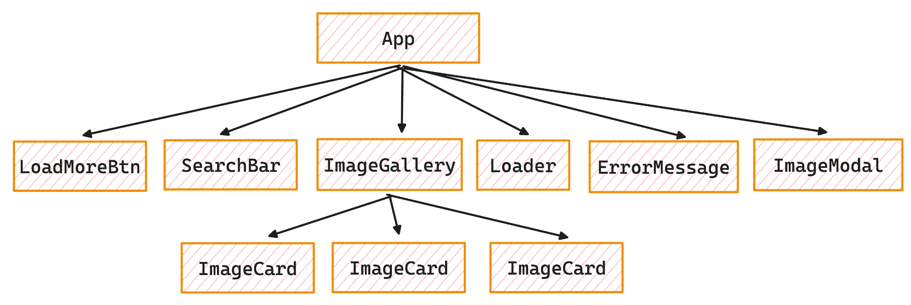

# Домашнє завдання `goit-react-hw-04`

### Пошук зображень

Напиши застосунок пошуку зображень за ключовим словом. Подивіться демо-відео роботи застосунку.

Сервіс пошуку зображень

!VIDEO

В цьому завданні, за допомогою HTTP-запитів, ти будеш отримувати зображення з сервісу зображень [Unsplash](https://unsplash.com/developers).

- Зареєструй аккаунт розробника, щоб отримати доступ до документації та можливості взаємодіяти з бекендом.
- Створи запис про своєму додатку на їхньому сервісі (блок **New Application**). Це обов'язковий крок. Придумай назву свого додатку, наприклад Image Gallery, Photo Search або щось подібне.
- Після створення запису про додаток, на його сторінці отримай в розділі **Keys** ключ доступу для HTTP-запитів (**Access Key**).

> ![NOTE] Для безкоштовної (Demo) версії додатків, кількість HTTP-запитів обмежено до 50 штук на годину, врахуй це і не роби багато непотрібних запитів!

Корисні для тебе розділи документації:
- [Як скласти URL-запиту](https://unsplash.com/documentation#schema)
- [Як додати ключ доступу до запитів](https://unsplash.com/documentation#public-authentication)
- [Пошук зображень за ключовим словом](https://unsplash.com/documentation#search-photos)

Відповідь від бекенда приходить об'єктом із всією необхідною інформацією. Там ти знайдеш масив зображень та загальну кількість груп для пагінації. Кожне зображення в масиві представлено об'єктом із великою кількістю інформації. В першу чергу тебе цікавлять посилання на різні за розміром версії зображення у властивості **urls**. Використовуй **small** версію для карток галереї, та **regular** версію для модального вікна.

> ![NOTE] Не обмежуйся завданням, використовуй дані із об'єктів, щоб відобразити більше цікавої інформації в модальному вікні. Наприклад, про автора зображення, кількість лайків, опис і т.д.

**Компоненти**
У цьому завданні тобі потрібно самостійно виділити наступні компоненти та додати базову стилізацію інтерфейсу на свій смак. Бери за приклад демо-відео роботи застосунку.


**Хедер з формою пошуку**

Компонент `SearchBar` приймає один проп `onSubmit` – функцію для передачі значення інпуту під час сабміту форми. Створює DOM-елемент наступної структури.

```html
<header>
  <form>
    <input
      type="text"
      autocomplete="off"
      autofocus
      placeholder="Search images and photos"
    />
    <button type="submit">Search</button>
  </form>
</header>
```

Якщо під час натискання кнопки відправки форми текстове поле порожнє, покажи користувачеві сповіщення про те, що необхідно ввести текст для пошуку зображень. Ця перевірка виконується в компоненті **SearchBar** в момент відправки форми. Для сповіщень використовуй бібліотеку [React Hot Toast](https://react-hot-toast.com/).

**Галерея зображень**

Компонент **ImageGallery** – це список карток зображень який створює DOM-елемент наступної структури.

```html
<ul>
	{/* Набір елементів списку із зображеннями */}
	<li>
		<div>
		  
		</div>
	</li>
</ul>
```
Галерея повинна рендеритися лише тоді, коли є які-небудь завантажені зображення. Це добра практика не включати елемент **li** в компонент карточки, а залишити його частиною компонента галереї.

**Картка зображення**

Компонент **ImageCard** рендериться в елементі галереї. Створює DOM-елемент наступної структури.

```html
<div>
  
</div>
```

**Індикатор завантаження**

Компонент **Loader** відображається під галереєю поки відбувається завантаження зображень. Використовуй будь-який готовий компонент, наприклад [react-loader-spinner](https://github.com/mhnpd/react-loader-spinner) або інший.

Поки йде завантаження зображень, індикатор завантаження не повинен замінювати галерею, а просто рендеритися під нею. Це буде критичним при додаванні зображень до вже завантажених.

**Повідомлення про помилку**

Компонент **ErrorMessage** рендериться замість галереї зображень у випадку помилки HTTP-запиту. Достатньо, щоб це було текстове повідомлення.

**Кнопка завантаження додаткових зображень**
Компонент **LoadMoreBtn** рендерить кнопку із текстом "Load more". При натисканні на кнопку має завантажуватися наступна порція зображень і рендеритися разом із попередніми.

- Кнопка має рендеритися лише тоді, коли є які-небудь завантажені зображення.
- Якщо масив зображень порожній, кнопка не рендериться.

**Модальне вікно**

Компонент **ImageModal** повинен рендеритися всередині компоненту **App** та отримувати через пропси з App всі необхідні дані та функції.

Під час натискання на зображення галереї повинно відкриватися модальне вікно **ImageModal** з темним фоном, яке відображатиме зображення у великому форматі. Модальне вікно має бути налаштовано таким чином, щоб воно закривалося при натисканні на клавішу **ESC** або при кліку за його межами. Для реалізації функціональності модального вікна використовуй бібліотеку [React Modal](https://github.com/reactjs/react-modal?tab=readme-ov-file#examples).
